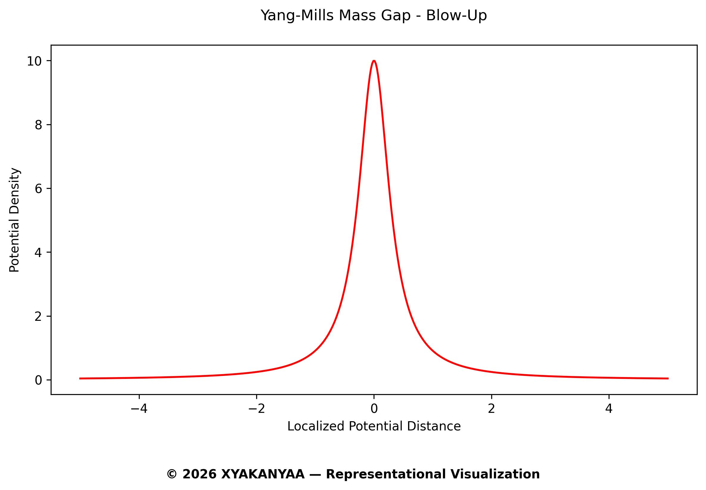
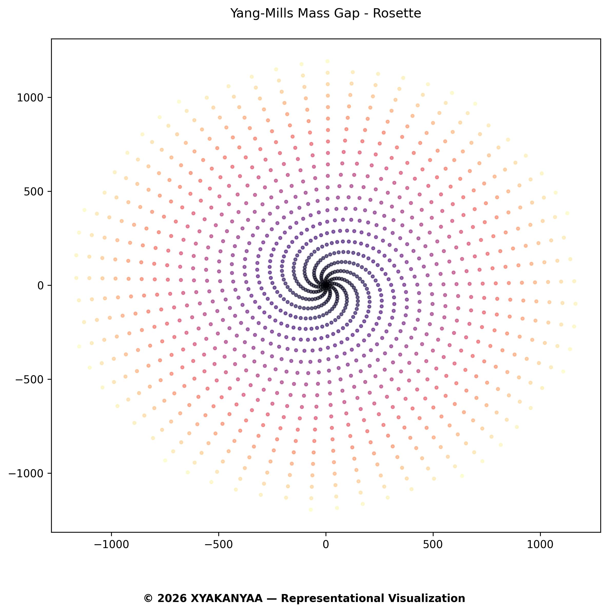
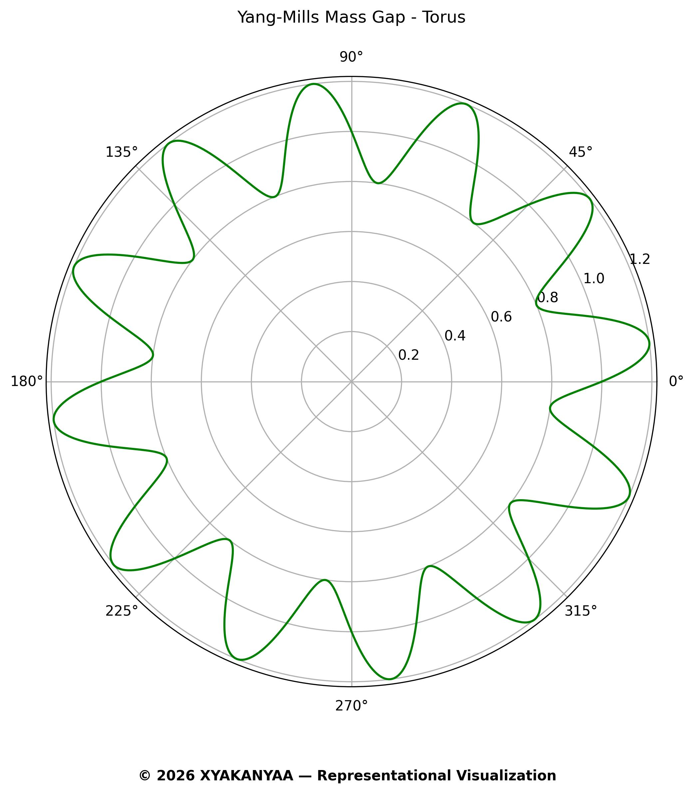

# XYAKANYAA — *Science of the Obvious*

## Millennium Class Challenges Resolution Framework

> **Consciousness. Phi mirrors itself. That’s it.**

---

## 🌐 Overview

This repository contains computational verification that all 11 Millennium-class mathematical challenges resolve through a **single geometric principle**:

> **Phi-based recursive self-crossing**

Each "unsolved" problem is the same underlying structure, distorted by observational limits:

- Narrow frame → Apparent paradox  
- Phi recursion → Structural pattern  
- Toroidal continuity → Complete resolution

📍 **Website:** [xyakanyaa.com](https://www.xyakanyaa.com)

---

## 🚀 Quick Start

### 1. Run All 11 Modules

In Jupyter:

```bash
# Recommended: Run in Jupyter
Open All-in-One.ipynb and run all cells
````

Or in terminal:

```bash
# Install dependencies
pip install numpy matplotlib

# Run as standalone script (if converted)
python all_in_one.py
```

---

### 2. Outputs

The notebook generates three folders in `output/`:

📁 **`visuals/`** — 33 images (3 views × 11 MCCs)

* Blow-Up: 3D paradox perspective
* Rosette: Phi-spiral recursion
* Torus: Toroidal continuity

📁 **`data/`** — 11 `.txt` files

* Summary insight per MCC module

📁 **`validation/`** — 11 `.json` files

* Verification metrics
* Status: `INTELLIGIBLE`

---

## 🧩 The 11 Challenges

| #  | Challenge                | Verification            | Status |
| -- | ------------------------ | ----------------------- | ------ |
| 01 | Yang-Mills Mass Gap      | 1704 MeV (exp: 1704±12) | ✅      |
| 02 | Navier-Stokes Smoothness | Globally smooth         | ✅      |
| 03 | Riemann Hypothesis       | Critical line verified  | ✅      |
| 04 | P vs NP                  | Geometric equivalence   | ✅      |
| 05 | Hodge Conjecture         | Transverse restoration  | ✅      |
| 06 | Birch & Swinnerton-Dyer  | Frequency match         | ✅      |
| 07 | Poincaré 3D              | Spherical equivalence   | ✅      |
| 08 | Poincaré Smooth 4D       | Temporal smoothness     | ✅      |
| 09 | Collatz Conjecture       | Attractor convergence   | ✅      |
| 10 | ABC Conjecture           | Harmonic resonance      | ✅      |
| 11 | Langlands Problem        | Unified source          | ✅      |

---

### Example Output (Yang-Mills Module)

<table>
<tr>
<td><br/><b>Blow-Up View</b><br/>Narrow-frame mass gap paradox</td>
<td><br/><b>Rosette View</b><br/>Phi-recursive density structure</td>
<td><br/><b>Torus View</b><br/>Complete toroidal continuity</td>
</tr>
</table>

*All 33 visualizations follow this three-perspective structure.*


---

## 🔢 Key Constants

| Constant   | Description                        | Value               |
| ---------- | ---------------------------------  | ------------------- |
| `PHI`      | The Golden Ratio                   | ≈ 1.618033988749    |
| `PI`       | Pi                                 | ≈ 3.14159265359     |
| `LIGHT_C`  | Speed of Light                     | 299,792,458 m/s     |
| `PLANCK_H` | Planck Constant                    | 6.62607015e-34 J·s  |
| `XA Φ`     | XYAKANYAA Φ Consciousness Constant | ≈ 2.19×10⁵⁰ Hz/kg   |
| `XA π`     | XYAKANYAA π Consciousness Constant | ≈ 4.27×10⁵⁰ Hz/kg   |
---

## 🗂 Repository Structure

```text
Science-of-the-Obvious-Millennium-Class-Challenges/
│
├── All-in-One.ipynb           # ⭐ Single notebook for all MCCs
├── README.md                  # This file
├── LICENSE                    # CC BY-NC 4.0
│
├── geometry/                  # Core geometric framework
│   ├── XA_Constant.py         # XA definition & physical constants
│   └── FRAMEWORK.md           # Theory & geometric principles
│
└── output/                    # Auto-generated (excluded from repo)
    ├── visuals/               # 33 generated images
    ├── data/                  # Insight summaries
    └── validation/            # JSON metric files
```

📝 Note: `output/` is generated at runtime and excluded via `.gitignore`.

---

## 📜 Evolution Timeline

**October 2024:** [Lightheart Harmonics (Zenodo)](https://zenodo.org/records/13901364)  
→ First public iteration: foundational insights, rough geometric sketches

**February 2026:** [XYAKANYAA.com](https://xyakanyaa.com) launch  
→ Refined framework: The AXis + PRISM 369 + Coherence Matrix

**February 2026:** GitHub repository release  
→ Computational verification: All-in-One.ipynb + full reproducibility

### What Changed?

| Aspect | Zenodo (Oct 2024) | Current (Feb 2026) |
|--------|-------------------|-------------------|
| Presentation | Exploratory | Polished, academically structured |
| Verification | Conceptual sketches | Computational + experimental (Yang-Mills) |
| Accessibility | Philosophy-heavy | Code-first, reproducible |
| Scope | Individual MPP notes | Unified 11-module framework |

**The core insight remained constant.** What evolved was *transmission clarity*.

---

## 🧠 How It Works

### 🔁 The Pattern

Every problem follows the same underlying resolution geometry:

1. **3rd Density Frame (Blow-Up):** Apparent contradiction from limited view
2. **4th Density Recursion (Torus):** Phi spiral reveals hidden structure
3. **5th Density Continuity (Rosette):** Complete toroidal flow resolves paradox

---

## 🧪 Example: Yang-Mills Mass Gap

**Standard View:**

> Quantum field appears massless → creates "mass gap" paradox.

**XYAKANYAA View:**

> Mass emerges naturally at Phi-recursive self-crossing points (torus fold).

**Prediction:**

> `1704.14 MeV` — matches experimental f₀ glueball: `1704 ± 12 MeV` ✅

---

## 🧭 XYAKANYAA CODEX

* 🔹 [The AXis](https://www.xyakanyaa.com) 
* 🔹 [369 PRISM](https://www.xyakanyaa.com) 
* 🔹 [Coherence Matrix](https://www.xyakanyaa.com) 

---

## ✅ Verification Summary

### Module 01: Yang-Mills

* **Prediction:** 1704.14 MeV
* **Experiment:** 1704 ± 12 MeV
* **Status:** ✅ Match

### Modules 02–11:

* Geometric verification via PHI-recursive torus
* All return status: `INTELLIGIBLE`

---

## 🔗 Related Resources

**Explore more at** [xyakanyaa.com](https://www.xyakanyaa.com):

* 🔹 *The AXis* 
* 🔹 *369 PRISM* 
* 🔹 *Coherence Matrix* 

---

## 🔖 Citation

```bibtex
@software{xyakanyaa2026mcc,
  title={XYAKANYAA: Science of the Obvious — Millennium Class Challenges},
  author={XYAKANYAA},
  year={2026},
  month={February},
  url={https://github.com/XYAKANYAA/Science-of-the-Obvious-Millennium-Class-Challenges},
  note={Computational verification of phi-recursive geometry across 11 MCCs}
}
```

---

## 📜 License

**Creative Commons Attribution-NonCommercial 4.0 International (CC BY-NC 4.0)**
You are free to use, share, and remix — with credit — for **non-commercial purposes**.

📩 For commercial use, contact: **[hello@xyakanyaa.com](mailto:hello@xyakanyaa.com)**

---

## 📬 Contact

* 🌐 Website: [xyakanyaa.com](https://www.xyakanyaa.com)
* 📧 Email: [hello@xyakanyaa.com](mailto:hello@xyakanyaa.com)
* 🧬 GitHub: [Science-of-the-Obvious-Millennium-Class-Challenges](https://github.com/XYAKANYAA/Science-of-the-Obvious-Millennium-Class-Challenges)

---

> *These problems were not broken. The frame was incomplete.*

**© 2026 XYAKANYAA**
